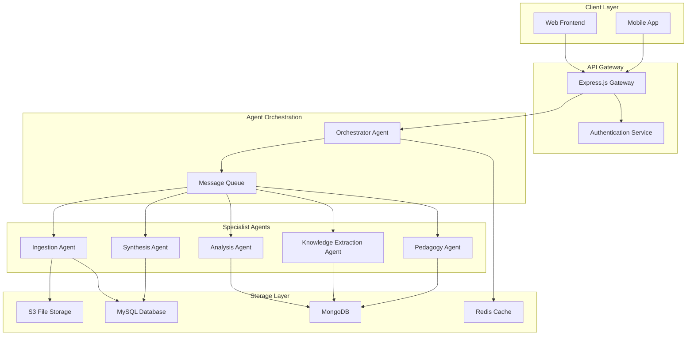

# Design Document

## Overview

The ZhiMo backend is a microservices-based system implementing a multi-agent architecture for intelligent academic material processing. The system follows a hub-and-spoke pattern with an Orchestrator Agent coordinating five specialized agents to transform raw learning materials into structured knowledge elements and personalized study materials.

## Architecture

### System Architecture Pattern
- **Pattern**: Multi-Agent Microservices with Event-Driven Communication
- **Communication**: Message queues (Redis/RabbitMQ) for agent coordination
- **Storage**: Hybrid approach - S3 for files, MySQL for metadata, document database for knowledge elements
- **API Gateway**: Express.js REST API with authentication and rate limiting

### High-Level Components



## Components and Interfaces

### 1. API Gateway Service (Express.js)

**Responsibilities:**
- Handle HTTP requests and responses
- Authentication and authorization
- Rate limiting and request validation
- Route requests to appropriate services

**Key Endpoints:**
```javascript
// File Management
POST /api/documents/upload
GET /api/documents/:id
DELETE /api/documents/:id

// Processing Control
POST /api/documents/:id/process
GET /api/documents/:id/status

// Knowledge Elements
GET /api/knowledge-elements
POST /api/knowledge-elements/search

// Annotations
POST /api/annotations
GET /api/annotations/document/:documentId

// Notebooks
POST /api/notebooks
GET /api/notebooks/:id
POST /api/notebooks/:id/export
```

### 2. Orchestrator Agent

**Responsibilities:**
- Receive and parse user instructions
- Decompose tasks into agent-specific workflows
- Coordinate agent execution and dependencies
- Monitor task progress and handle failures

**Core Interface:**
```javascript
class OrchestratorAgent {
  async processDocument(documentId, instructions) {
    // Parse user intent and create task plan
    // Coordinate agent execution
    // Return processing status
  }
  
  async getProcessingStatus(documentId) {
    // Return current processing state
  }
}
```

### 3. Ingestion Agent

**Responsibilities:**
- Parse multiple file formats (PDF, Word, PPT, images)
- OCR processing for image-based content
- Web content extraction
- Text standardization and structure extraction

**Processing Pipeline:**
```javascript
class IngestionAgent {
  async processFile(fileInfo) {
    const processor = this.getProcessor(fileInfo.type);
    const rawContent = await processor.extract(fileInfo.path);
    const structuredText = await this.standardize(rawContent);
    return structuredText;
  }
  
  async standardize(content) {
    // Convert to standard JSON format
    return {
      title: string,
      sections: [{
        heading: string,
        content: string,
        subsections: []
      }],
      metadata: {}
    };
  }
}
```

### 4. Analysis Agent

**Responsibilities:**
- Generate summaries of various lengths
- Perform topic modeling and theme extraction
- Analyze document structure and logical flow
- Sentiment and viewpoint analysis

**Analysis Interface:**
```javascript
class AnalysisAgent {
  async generateSummary(structuredText, options) {
    // Generate summary based on length and style requirements
  }
  
  async analyzeStructure(structuredText) {
    // Extract logical structure and create mind map data
  }
  
  async extractTopics(structuredText) {
    // Identify main themes and topics
  }
}
```

### 5. Knowledge Extraction Agent

**Responsibilities:**
- Named entity recognition (NER)
- Definition and concept extraction
- Formula and theorem identification
- Relationship extraction between entities

**Extraction Interface:**
```javascript
class KnowledgeExtractionAgent {
  async extractEntities(structuredText) {
    // Return entities with types and positions
  }
  
  async extractDefinitions(structuredText) {
    // Return term-definition pairs
  }
  
  async extractFormulas(structuredText) {
    // Return mathematical formulas and equations
  }
  
  async extractRelationships(entities) {
    // Return entity relationships
  }
}
```

### 6. Pedagogy Agent

**Responsibilities:**
- Generate various question types (MCQ, fill-in-blank, short answer)
- Create flashcards from definitions
- Generate open-ended discussion questions
- Adapt content for different learning styles

**Pedagogy Interface:**
```javascript
class PedagogyAgent {
  async generateQuestions(knowledgeElements, questionType) {
    // Generate questions based on extracted knowledge
  }
  
  async createFlashcards(definitions) {
    // Convert definitions to flashcard format
  }
  
  async generateOpenQuestions(topics) {
    // Create thought-provoking questions
  }
}
```

### 7. Synthesis Agent

**Responsibilities:**
- Compile selected knowledge elements into notebooks
- Apply formatting templates
- Generate PDF exports
- Create knowledge network visualizations

**Synthesis Interface:**
```javascript
class SynthesisAgent {
  async compileNotebook(notebookComposition) {
    // Gather and organize selected elements
  }
  
  async applyTemplate(content, templateType) {
    // Apply formatting template
  }
  
  async exportToPDF(notebook) {
    // Generate formatted PDF
  }
}
```

## Data Models

### Documents Table (MySQL)
```sql
CREATE TABLE documents (
  id CHAR(36) PRIMARY KEY,
  user_id CHAR(36) NOT NULL,
  original_name VARCHAR(255) NOT NULL,
  file_type VARCHAR(50) NOT NULL,
  s3_path VARCHAR(500) NOT NULL,
  processing_status VARCHAR(50) DEFAULT 'pending',
  upload_timestamp TIMESTAMP DEFAULT CURRENT_TIMESTAMP,
  processed_timestamp TIMESTAMP NULL,
  metadata JSON,
  INDEX idx_user_id (user_id),
  INDEX idx_processing_status (processing_status)
);
```

### Knowledge Elements Collection (MongoDB)
```javascript
{
  _id: ObjectId,
  document_id: UUID,
  agent_type: String, // 'analysis', 'extraction', 'pedagogy'
  element_type: String, // 'summary', 'definition', 'formula', 'question'
  content: {
    // Flexible structure based on element_type
    title: String,
    body: String,
    metadata: Object
  },
  source_location: {
    section: String,
    page: Number,
    position: Object
  },
  created_at: Date,
  tags: [String]
}
```

### Annotations Table (MySQL)
```sql
CREATE TABLE annotations (
  id CHAR(36) PRIMARY KEY,
  user_id CHAR(36) NOT NULL,
  document_id CHAR(36) NOT NULL,
  annotation_type VARCHAR(50), -- 'highlight', 'note', 'bookmark'
  content TEXT,
  position_data JSON, -- Precise location information
  created_at TIMESTAMP DEFAULT CURRENT_TIMESTAMP,
  updated_at TIMESTAMP DEFAULT CURRENT_TIMESTAMP ON UPDATE CURRENT_TIMESTAMP,
  INDEX idx_user_document (user_id, document_id),
  INDEX idx_document_id (document_id)
);
```

### Review Notebooks Table (MySQL)
```sql
CREATE TABLE review_notebooks (
  id CHAR(36) PRIMARY KEY,
  user_id CHAR(36) NOT NULL,
  title VARCHAR(255) NOT NULL,
  description TEXT,
  created_at TIMESTAMP DEFAULT CURRENT_TIMESTAMP,
  updated_at TIMESTAMP DEFAULT CURRENT_TIMESTAMP ON UPDATE CURRENT_TIMESTAMP,
  INDEX idx_user_id (user_id)
);
```

### Notebook Composition Table (MySQL)
```sql
CREATE TABLE notebook_composition (
  id CHAR(36) PRIMARY KEY,
  notebook_id CHAR(36) NOT NULL,
  element_type VARCHAR(50), -- 'knowledge_element', 'annotation'
  element_id VARCHAR(255) NOT NULL, -- UUID or MongoDB ObjectId
  order_index INTEGER NOT NULL,
  INDEX idx_notebook_order (notebook_id, order_index),
  FOREIGN KEY (notebook_id) REFERENCES review_notebooks(id) ON DELETE CASCADE
);
```

## Error Handling

### Agent Communication Errors
- **Timeout Handling**: 30-second timeout for agent responses
- **Retry Logic**: Exponential backoff for failed agent calls
- **Circuit Breaker**: Disable failing agents temporarily
- **Fallback Mechanisms**: Graceful degradation when agents are unavailable

### File Processing Errors
- **Format Validation**: Pre-validate file types and sizes
- **OCR Failures**: Retry with different OCR engines
- **Parsing Errors**: Log detailed error information and notify users
- **Storage Failures**: Implement S3 retry logic and backup storage

### Database Errors
- **Connection Pooling**: Manage database connections efficiently
- **Transaction Rollback**: Ensure data consistency on failures
- **Replication Lag**: Handle read replica delays
- **Migration Safety**: Zero-downtime database migrations

## Testing Strategy

### Unit Testing
- **Agent Logic**: Test each agent's core processing functions
- **API Endpoints**: Test all REST endpoints with various inputs
- **Data Models**: Test database operations and constraints
- **Utility Functions**: Test file processing and validation utilities

### Integration Testing
- **Agent Coordination**: Test multi-agent workflows end-to-end
- **Database Integration**: Test data flow between services
- **External Services**: Test S3, OCR, and other external integrations
- **Message Queue**: Test async communication patterns

### Performance Testing
- **Load Testing**: Test system under concurrent user load
- **File Processing**: Test with various file sizes and types
- **Agent Scalability**: Test agent performance under load
- **Database Performance**: Test query performance and optimization

### End-to-End Testing
- **User Workflows**: Test complete user journeys
- **Error Scenarios**: Test system behavior under various failure conditions
- **Data Consistency**: Verify data integrity across services
- **Security Testing**: Test authentication and authorization flows