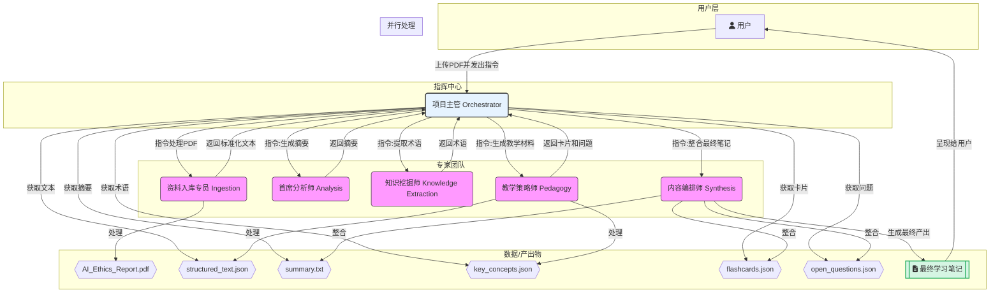

### Agent 协作流程详解

整个流程由“项目主管 (Orchestrator Agent)”作为总指挥，确保任务被正确地拆解、分发、整合。

**第 1 步：接收与规划 (Orchestrator)**

1. **用户交互**：用户通过界面上传 `AI_Ethics_Report.pdf` 并输入上述指令。
2. **指令解析**：**项目主管 (Orchestrator)** 接收到文件和指令。它首先需要理解用户的意图。通过自然语言理解（NLU），它将指令拆解成一个结构化的任务清单：
   - **源文件**: `AI_Ethics_Report.pdf`
   - **任务1**: 生成 `摘要` (analysis)
   - **任务2**: 提取 `关键术语` 并制作 `概念卡片` (knowledge extraction + pedagogy)
   - **任务3**: 生成 `开放性问题` (pedagogy)
3. **制定工作流**：基于任务清单，项目主管规划出最优的执行路径。它知道，所有任务都依赖于标准化的文本内容，因此第一步永远是调用“资料入库专员”。

**第 2 步：资料标准化 (Ingestion)**

1. **任务分派**：项目主管向 **资料入库专员 (Ingestion Agent)** 发出指令：“处理 `AI_Ethics_Report.pdf`”。
2. **执行处理**：资料入库专员接收PDF，调用内部的解析或OCR引擎，将其转换为干净、统一的JSON结构化文本，其中包含章节、段落等信息。
3. **结果返回**：处理完成后，它将 `structured_text.json` 的路径或内容返回给项目主管，并告知任务完成。

**第 3 步：并行分析与挖掘 (Analysis & Knowledge Extraction)**

项目主管知道“生成摘要”和“提取术语”这两个任务可以并行处理以提高效率。

1. **任务并行分派**:
   - **分派给首席分析师 (Analysis Agent)**：指令为“根据 `structured_text.json` 生成一份核心摘要。”
   - **分派给知识挖掘师 (Knowledge Extraction Agent)**：指令为“从 `structured_text.json` 中提取所有关键术语及其定义。”
2. **专家执行**:
   - **首席分析师** 进行深度阅读和分析，产出 `summary.txt`。
   - **知识挖掘师** 扫描文本，精准抽取出 `[{"term": "算法偏见", "definition": "..."}, {"term": "责任归属问题", "definition": "..."}]` 这样的 `key_concepts.json`。
3. **结果汇总**：两位专家完成任务后，分别将结果返回给项目主管。

**第 4 步：教学内容生成 (Pedagogy)**

项目主管现在拥有了摘要和关键术语，可以进行教学材料的生成了。

1. **任务串行分派**:
   - **分派任务A**：项目主管将 `key_concepts.json` 发送给 **教学策略师 (Pedagogy Agent)**，指令：“将这些术语和定义制作成概念卡片（Flashcards）格式。”
   - **分派任务B**：项目主管将完整的 `structured_text.json`（或 `summary.txt`）发送给 **教学策略师**，指令：“基于文本的核心议题，生成3个开放性思考题。”
2. **专家执行**:
   - 教学策略师根据指令，生成 `flashcards.json` 和 `open_questions.json`。
3. **结果返回**：教学策略师将两份产出物返回给项目主管。

**第 5 步：整合与呈现 (Synthesis)**

所有必需的材料（摘要、卡片、问题）都已备齐。

1. **最终整合指令**：项目主管调用 **内容编排师 (Synthesis Agent)**，并将 `summary.txt`, `flashcards.json`, `open_questions.json` 作为输入材料，指令：“将以下材料整合成一份名为‘人工智能伦理学习笔记’的文档，排版要清晰美观。”
2. **智能排版**：内容编排师根据预设的模板，将内容进行智能组合与排版。
   - 第一部分：核心摘要
   - 第二部分：概念卡片（可能以表格或列表形式呈现）
   - 第三部分：深度思考题
3. **最终产出**：内容编排师生成最终的 `Study_Guide.md` (Markdown格式，易于渲染) 或直接生成 PDF。
4. **交付用户**：内容编排师将最终产出物交给项目主管，项目主管最后将其呈现在用户界面上。任务完成。

